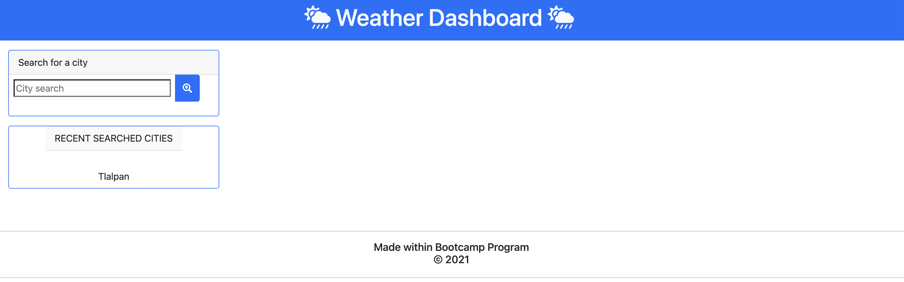
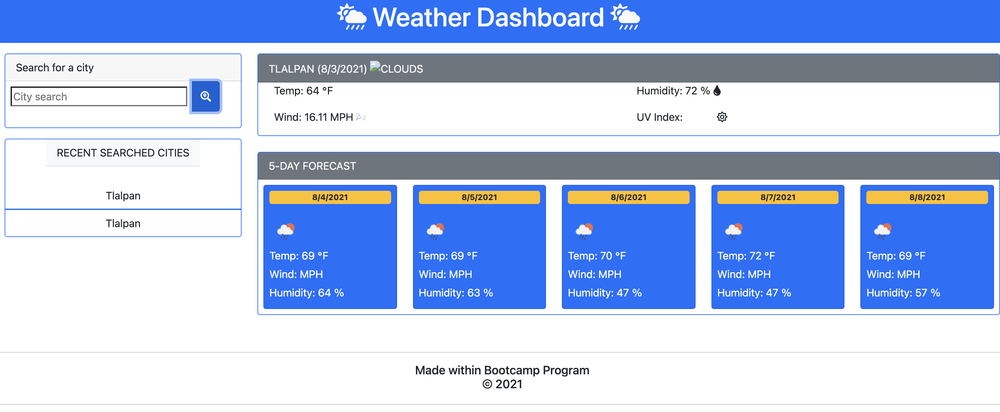

# Smart-Weather-Dashboard

## Description

Aplication is able to search for a city

## Table of Contents

* [Installation](#installation)
* [Usage](#usage)
* [Screenshots](#screenshots)
* [Credits](#credits)
* [References](#references)

## Installation

For usage and be able to display functionality:

1. Clone the repository: https://github.com/sandraileana/Smart-Weather-Dashboard.git and open it on browser.

OR

2. Open directly through https://sandraileana.github.io/Smart-Weather-Dashboard/

## Usage

After this the user will be able to:

  * Search for a city.

  * Obtain actual and 5-day forecast weather.

  * Last 10 cities will be saved in recent searched cities

## Screenshots

1. Weather Dashboard

2. Weather Dashboard Example

## Credits

* Author: Sandra Pérez
* [Github](https://github.com/sandraileana)

## References
1. For fas fa clou-sun-rain: https://fontawesome.com/icons/cloud-sun-rain
2. For fas fa search location: https://fontawesome.com/icons/search-location?style=solid
3. Bootstrap spacing: https://getbootstrap.com/docs/5.0/utilities/spacing/#notation
4. For cards: https://getbootstrap.com/docs/5.0/components/card/ 
5. For badges and labels: https://getbootstrap.com/docs/5.0/components/badge/
6. For buttons: https://getbootstrap.com/docs/5.0/components/buttons/
7. For spacing: https://getbootstrap.com/docs/5.0/utilities/spacing/
8. For Bootstrap utilities: https://www.w3schools.com/bootstrap4/bootstrap_utilities.asp
9. For row-columns: https://getbootstrap.com/docs/5.0/layout/grid/#row-columns
10. For symbols: https://www.compart.com/de/unicode/
11. For JS string reference: https://www.w3schools.com/jsref/jsref_obj_string.asp 
12. API key open weather: https://home.openweathermap.org/api_keys
13. Math.round: https://developer.mozilla.org/es/docs/Web/JavaScript/Reference/Global_Objects/Math/round 
14. For Bootstrap 4 Grid Examples: https://www.w3schools.com/bootstrap4/bootstrap_grid_examples.asp
15. For input group: https://getbootstrap.com/docs/5.0/forms/input-group/
16. For fetch: https://developer.mozilla.org/es/docs/Web/API/Fetch_API/Using_Fetch
17. To create functions: https://www.w3schools.com/js/js_functions.asp
18. JS events: https://www.w3schools.com/js/js_events.asp
19. JS loops: https://www.w3schools.com/js/js_loop_for.asp
20. JS Jason: https://www.w3schools.com/js/js_json.asp